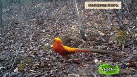
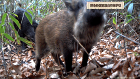
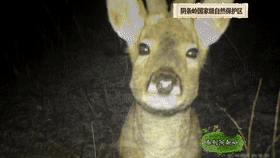

# First_AI_Project
It's a half day tutorials for AI beginners...

  
 <b>Version:</b> v0.1 <b>Date:</b> 2020-06-09 

在本课程中，我们将着手构建一个端到端的人工智能项目，回顾前述课程学习的内容，通过动手实践来强化对相关概念和知识的认识及了解。 
希望对你未来的工作会有所帮助。

<b>💡:</b> 

- 预计时间： 2小时-3小时；
- 技能要求：基本的编程知识(如果会点python更好)；  
- 前期准备：人工智能实训平台 + 可以连接网络的浏览器

## 项目背景

  
概要✅：

> 假设你所在公司受一个动物保护协会委托，要为他们开发一款软件，用来通过部署在自然保护区的监控摄像头捕获照片，并利用人工智能算法自动识别图像中的动物类型。通过构建这样一套监控系统，有助于他们快速统计相关珍惜动物的生活习性及繁殖情况，有利于提前对濒临灭绝的珍稀物种进行必要的援助。

    

  
<b>重要📌</b>

分析用户需求尽量考虑全面、思考周详，开展工作尽量缩小范围，聚焦核心.   

  
✅：

- 为了评估这件事情的可行性，我们通过一个课程实验重点关注这套系统中人工智能识别部分的可行性。在PoC阶段，为了降低问题的复杂性，我们将选取几种容易获取的物种照片，通过检索引擎快速搜索图片，构建原型模型。
  
- 为了快速对用户的问题进行分析，我们没办法及时从客户手中获得足够多的数据，但如果客户场景数据容易通过公共渠道快速获取，我们可以利用相关工具获取部分数据(比如比赛数据、用户分享数据、检索引擎数据)；
  
- 在本实验中，为了能够在2-3个小时内，能够完成这个项目，我们理想化的处理可行性分析阶段的数据，缩小范围为识别几种常见的🐕的品种。
  

